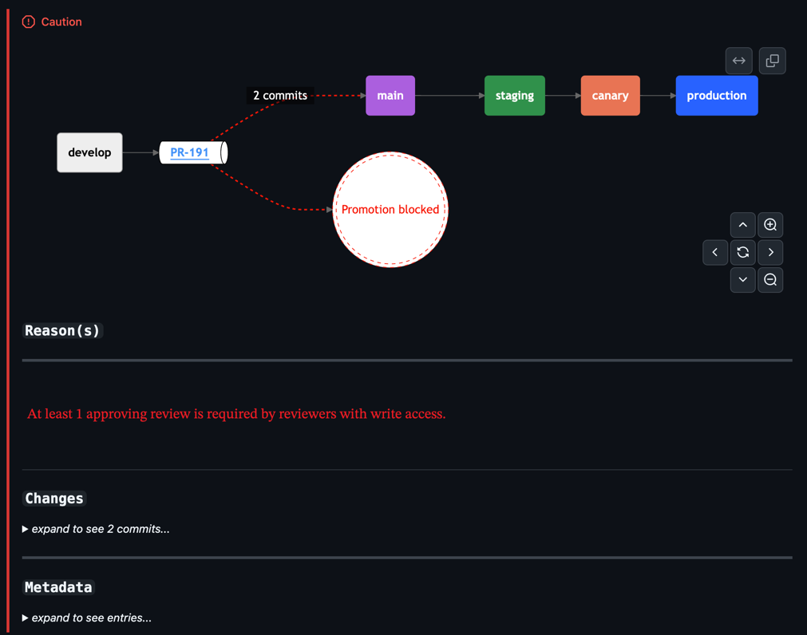
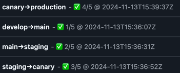

[](https://github.com/isometry/gh-promotion-app/actions/workflows/codeql.yaml)
[](https://goreportcard.com/report/github.com/isometry/gh-promotion-app)
<br>
[](https://github.com/isometry/gh-promotion-app/actions/workflows/main.yaml)
[](https://github.com/isometry/gh-promotion-app/actions/workflows/publish.yaml)
<br>

<p align="center">
    
    <br>
    <i>gh-promotion-app</i>
    <br>
    🔎 <a href="#how-it-works">How it works</a> | 👍 <a href="#contributing">Contributing</a>
    <br><br>
</p>

## How it works

The `gh-promotion-app` is a service that automates the promotion of GitHub branch across environments. It is designed to
operate as a GitHub App and respond to the webhook events to which its App is subscribed.
It currently supports the following event types:

| Event Type            | Description                                                        |
|-----------------------|--------------------------------------------------------------------|
| `push`                | Change is **pushed** to a given branch                             |
| `pull_request`        | Pull request is **opened**, **reopened** or **closed**             |
| `pull_request_review` | Pull request review is **approved**                                |
| `check_suite`         | Check suite is **completed**                                       |
| `deployment_status`   | Deployment status is marked as **success**                         |
| `status`              | When the status of a Git commit changes to **success**             |
| `workflow_run`        | Workflow run conclusion is **completed** and status is **success** |

> [!TIP]
> Check the full docs locally with [pkgsite](https://github.com/golang/pkgsite) by running the following command:
> ```console
> go install golang.org/x/pkgsite/cmd/pkgsite@latest \
>   && pkgsite
> ```

### Overview

<p align="center">
    
</p>

### Running

The `gh-promotion-app` can be run in two modes:

1. **Lambda**: The application is deployed as an AWS Lambda function and is triggered by an API Gateway endpoint.
    ```console
    go run main.go lambda # or go run main.go --mode=lambda
    ```
2. **Service**: The application is deployed as a standalone service and listens for incoming HTTP requests.
    ```console
    go run main.go service # or go run main.go --mode=service
    ```

### Feedback

> [!NOTE]
> Only one feedback mechanism should be enabled at a time to avoid conflicts.

#### Check Run (`default`)

GitHub offers a more detailed check-run feedback mechanism. The initial format is equivalent to the commit status,
however when clicked, it provides a more detailed view of the promotion process.

<details>
<summary>Example...</summary>



</details>

#### Commit Status

Commits that are part of a promotion are marked with a status check. The format is as follows:

`{source}→{target} - {status} @ {timestamp}`

<details>
<summary>Example...</summary>



</details>


### Configuration

The application can be configured using environment variables, a YAML configuration file and/or command-line arguments.
The location of the configuration file is specified using the `-c, --config` flag, it defaults to `config.yaml`.

<details>
<summary>Sample configuration file</summary>

[config.sample.yaml](config.sample.yaml)

```yaml
---
global:
  mode: <string>            # (defaults to "lambda")
  logging:
    verbosity: <int>         # 0:WarnLevel 1:InfoLevel 2:DebugLevel (defaults to 0)
    callerTrace: <bool>      # (defaults to false)
  s3:
    upload:
      enabled: <bool>         # (defaults to false)
      bucketName: <string>

promotion:
  defaultStages: <[]string> # (defaults to ["main", "stating", "canary", "production"])
  dynamicPromotion:
    enabled: <bool>          # (defaults to true)
    key: <string>            # (defaults to "gitops-promotion-path")
  push:
    createTargetRef: <bool>  # (defaults to true)
  feedback:
    commitStatus:
      enabled: <bool>         # (defaults to true)
      context: <string>       # (defaults to "{source}→{target}")
    checkRun:
      enabled: <bool>         # (defaults to true)
      name: <string>          # (defaults to "{source}→{target}")

github:
  authMode: <string>        # (defaults to "ssm")
  ssmKey: <string>
  webhookSecret: <string>

service:
  path: <string>            # (defaults to "/")
  addr: <string>
  port: <string>            # (defaults to "8080")
  timeout: <duration>       # (defaults to "5s")

lambda:
  payloadType: <string>     # (defaults to "api-gateway-v2")
```

</details>

For all available configuration options, see the included sample configuration
file [config.sample.yaml](config.sample.yaml)
and refer to the [Usage](#usage) section.

> [!NOTE]
> When the `github.authMode` key is set to `token`, the `GITHUB_TOKEN` environment variable must be set with a valid
> GitHub token.
> If the `promotion.feedback.checkRun.enabled` key is set to `true`, the fetched token value must be spawned from a
> GitHub app installation.

### Authentication modes

GitHub interactions are handled by:
* v3 API [go-github](https://github.com/google/go-github)
* v4 API [graphql](https://github.com/graphql-go/graphql)

#### Token (`GITHUB_TOKEN`)

Personal access token w/ permissions compatible with the selected configuration.

> [!NOTE]
> PATs are not allowed to create new check-run(s). You will need to use a [GitHub app](#github-app) installation instead.

#### GitHub App

At this time, the application requires that the GitHub app installation secrets are stored in AWS SSM.

The supported format is as follows:
    
```json
{
    "app_id": "<int64>",
    "private_key": "<string>",
    "webhook_secret": "<string>"
}
```

The above credentials are then used to authenticate to GitHub on behalf of the app.
Fetched secrets are cached in-memory per-GitHub app installation ID as to avoid unnecessary requests.

AWS interactions are handled by the [aws-sdk-go-v2](https://github.com/aws/aws-sdk-go-v2) SDK.

> [!NOTE]
> The GitHub app permissions must be compatible with the selected configuration.

### Usage

```console
Usage:
   [flags]
   [command]

Available Commands:
  lambda
  service

  -c, --config string                                  path to the configuration file (default "config.yaml")
      --create-missing-target-branches                 [CREATE_MISSING_TARGET_BRANCHES] Create missing target branches (default true)
      --feedback-check-run                             [FEEDBACK_CHECK_RUN] Enable check-run feedback (default true)
      --feedback-check-run-name string                 [FEEDBACK_CHECK_RUN_NAME] The name to use when creating the check run. Supported placeholders: {source}, {target} (default "{source}→{target}")
      --feedback-commit-status                         [FEEDBACK_COMMIT_STATUS] Enable commit status feedback (default true)
      --feedback-commit-status-context string          [FEEDBACK_COMMIT_STATUS_CONTEXT] The context key to use when pushing the commit status to the repository. Supported placeholders: {source}, {target} (default "{source}→{target}")
      --github-app-ssm-arn string                      [GITHUB_APP_SSM_ARN] The SSM parameter key to use when fetching GitHub App credentials
  -A, --github-auth-mode string                        [GITHUB_AUTH_MODE] Authentication credentials provider. Supported values are 'token' and 'ssm'. (default "ssm")
      --github-webhook-secret string                   [GITHUB_WEBHOOK_SECRET] The secret to use when validating incoming GitHub webhook payloads. If not specified, no validation is performed
  -h, --help                                           help for this command
      --mode string                                    [MODE] The application runtime mode. Possible values are 'lambda' and 'service' (default "lambda")
      --promotion-default-stages strings               [PROMOTION_DEFAULT_STAGES] The default promotion stages (default [sdasd])
      --promotion-dynamic                              [PROMOTION_DYNAMIC] Enable dynamic promotion (default true)
      --promotion-dynamic-custom-property-key string   [DYNAMIC_PROMOTION_KEY] The key to use when fetching the dynamic promoter configuration (default "gitops-promotion-path")
      --promotion-report-s3-upload                     [PROMOTION_REPORT_S3_UPLOAD] Enable S3 upload of promotion reports
      --promotion-report-s3-upload-bucket string       [PROMOTION_REPORT_S3_BUCKET] The S3 bucket to use when uploading promotion reports
  -v, --verbose count                                  [VERBOSE] Increase logger verbosity (default WarnLevel)
  -V, --caller-trace                                   [CALLER_TRACE] Enable caller trace in logs
```

## Contributing

* Feel free to open an issue describing the problem you are facing or the feature you want to see implemented.
* If you want to contribute, fork the repository and submit a pull request.
    * Make sure to follow the [Conventional Commits](https://www.conventionalcommits.org/en/v1.0.0/) specification.
